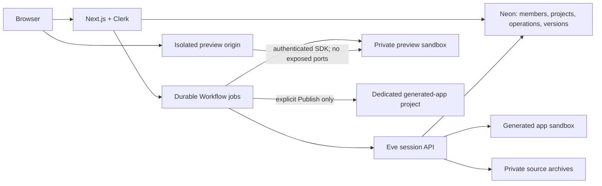

# Eveable

Eveable is an open-source, Lovable-style website builder built on Vercel Eve.
Its web workspace lets invited members discuss a design, approve a build or
edit, edit code, inspect saved source versions, open an isolated preview, and explicitly
publish a version to Vercel. Generated Next.js applications are outputs, not the
source of Eveable's own frontend.

Version: `1.0.0`. The frontend implementation is included; hosted acceptance and
production rollout require the service setup below. Local fixtures are not
proof of live provider behavior. See [FRONTEND_ACCEPTANCE.md](FRONTEND_ACCEPTANCE.md)
for completed local checks and the outstanding hosted acceptance gates.

## Architecture

- `apps/web`: Next.js App Router application, Clerk sign-in, project APIs,
  sanitized NDJSON activity, Workflow jobs, and the isolated preview gateway.
- `agent`: existing Eve runtime, specialist subagents, narrow sandbox tools,
  design approvals, source-aware editing, validation, and version capture.
- `packages/core`: shared Drizzle/Postgres schema, ownership and operation
  admission, source archives, runtime authentication, preview and release adapters.
- `tests`: contract tests, disposable Postgres integration tests, browser component
  acceptance fixtures, and opt-in hosted acceptance.



Deploy the frontend and runtime as **separate Vercel projects**. The preview
wildcard domain routes to the web deployment, but is a separate browser origin.
Every generated customer application gets its own Vercel project.

Eve owns session execution and durable event history. Neon stores account-owned
project metadata and safe projections. Continuation tokens never reach browser
code. Runtime event handlers persist progress even after the browser closes;
a durable reconciliation job replays missed events.

Persist the channel-local HTTP continuation token: Eve event callbacks expose
an additional outer `eve:` namespace, which the runtime removes once before
storage. Sending that internal namespace back through the HTTP client would
prevent design approvals, including Stop, from resuming the existing session.
Redeploying does not repair previously corrupted sessions or clear operation
locks. Recovery must confirm their workflows are stopped before releasing locks;
archive an abandoned project and start a new one rather than reusing its token.

## Requirements

- Node.js `>=24 <27` (CI uses Node 24)
- pnpm `11.5.0`
- Eve `0.18.0` and AI SDK `7.0.0` are pinned in the lockfile
- Clerk, Neon Postgres, private Vercel Blob, Vercel Sandbox, and a managed Vercel team

Install with `pnpm install --frozen-lockfile`. Do not use npm to manage this repository.

## Configuration

`env.sample` is the canonical list of settings. Copy the relevant settings to
root `.env.local` for the runtime and `apps/web/.env.local` for Next.js. Keep all
secrets out of version control. Only Clerk's publishable key is browser-public.

| Settings | Runtime | Web |
| --- | --- | --- |
| `DATABASE_URL` | Yes | Yes |
| `EVEABLE_RUNTIME_SECRET` | Yes | Yes, identical value |
| `BLOB_READ_WRITE_TOKEN` | Yes | Yes, same private store |
| `AI_GATEWAY_API_KEY` and model overrides | Yes | No |
| Refero MCP / Unsplash credentials | Optional | No |
| `NEXT_PUBLIC_CLERK_PUBLISHABLE_KEY`, `CLERK_SECRET_KEY` | No | Yes |
| `APP_ORIGIN`, `EVE_RUNTIME_ORIGIN` | No | Yes |
| `PREVIEW_ORIGIN`, `EVEABLE_PREVIEW_SECRET` | No | Yes |
| `VERCEL_TOKEN`, `VERCEL_TEAM_ID` | No | Yes |
| Sandbox authentication (`VERCEL_OIDC_TOKEN`, or supported SDK token credentials) | Hosted/runtime-specific | Yes |

Generate independent random signing secrets with at least 32 characters. Use
separate secrets and databases for development, staging, and production.
Do not provide Eveable's credentials as generated-app environment variables.
The legacy `VERCEL_PROJECT_NAME`, `VERCEL_SCOPE`, and deployment environment
allowlist no longer control publishing.

### Membership and authentication

1. Configure Clerk invite-only registration and verified email sign-in.
2. Configure sign-in/sign-up URLs for `/sign-in` and `/sign-up`.
3. Apply the database migration to the intended development/staging database:
   `pnpm db:migrate` (reads root `.env.local`).
4. Invite a user through Clerk and obtain their Clerk user ID.
5. Run `pnpm member:provision user_…`. Revoke with `pnpm member:revoke user_…`.

A Clerk account or invitation alone is not authorization. Every protected
request requires active database membership and project ownership. Revocation
also denies preview requests and subsequent privileged workflow actions.

### Preview domain

Set `APP_ORIGIN=https://builder.example.com` and
`PREVIEW_ORIGIN=https://preview.example.net`. Configure a wildcard
`*.preview.example.net` on the **web** Vercel project with TLS. Do not put the
builder's session cookies on the preview domain.

For local HTTP use `APP_ORIGIN=http://localhost:3000` and
`PREVIEW_ORIGIN=http://preview.localhost:3000`; configure local wildcard DNS if
your browser/resolver does not resolve `*.localhost` to loopback. Hosted
acceptance must use HTTPS, including partitioned secure preview cookies.

Each preview uses a unique host, a short-lived access grant, and a sandbox with
**no exposed network ports**. The gateway checks membership and fetches bounded
HTTP responses through the Sandbox SDK. Generated code receives no platform
credentials or builder cookies. This first release supports HTTP previews, not
WebSockets or hot module reload. Responses are limited to 8 MB and request
bodies to 1 MB. Sandboxes expire after a bounded 20-minute lifetime; restarting
materializes the saved artifact again. Opening a preview requires Vercel Sandbox
credentials even when the frontend runs locally.

### Publishing setup

The web project holds the managed team's `VERCEL_TOKEN` and `VERCEL_TEAM_ID`.
Publishing creates a project named `eveable-<project UUID>`, uploads the approved
immutable source, verifies its preview deployment, promotes it, then verifies
the observed production alias. The UI records success only after verification.

Generated projects must have no configured or shared environment variables.
Do not attach platform integrations or secrets to them. Deployment protection
must allow the verification service to reach candidate URLs; otherwise
publishing fails closed before promotion. Project-level OIDC is disabled on
new generated-app projects. No provider secrets are sent with deployment files.

## Local development

```bash
pnpm dev          # Eve API, normally http://127.0.0.1:2000
pnpm web:dev      # Next.js, http://localhost:3000 (second terminal)
```

Set `EVE_RUNTIME_ORIGIN=http://127.0.0.1:2000` for the web server. Authentication
between web and Eve uses signed requests even locally. Missing configuration
shows a setup screen rather than fictional project data.

`pnpm dev:tui` retains Eve's terminal interface, and `pnpm dev:verbose` shows
full developer diagnostics. To intentionally enable local curl/TUI access, set
`EVEABLE_ALLOW_LOCAL_TUI=true` in root `.env.local`. It is ignored when
`NODE_ENV=production`; deployed session routes require application authorization.

The Eve dev scripts still clear `.eve`, `.output`, and `.workflow-data` on
restart. **That invalidates local Eve session handles.** Local projects and
source archives remain in application storage; start a new session after a
runtime cache reset. Do not treat local workflow files as production storage.

With explicit local TUI access enabled, start and resume sessions as before:

```bash
curl -X POST http://127.0.0.1:2000/eve/v1/session \
  -H 'content-type: application/json' -d '{"message":"Build a small studio website"}'
curl -N http://127.0.0.1:2000/eve/v1/session/<sessionId>/stream
curl -X POST http://127.0.0.1:2000/eve/v1/session/<sessionId> \
  -H 'content-type: application/json' \
  -d '{"continuationToken":"<continuationToken>","message":"Approve and build"}'
```

TUI builds can validate a local sandbox preview. They do not impersonate a web
project, save managed versions, or deploy from inside the sandbox.

## Builder contract

1. Every non-approval request calls `intent` first, alone. Subagent calls have
   exactly one input key: `message`.
2. Builds and edits pass through planning/design research and explicit approval:
   **Approve and build**, **Revise design**, or **Stop**. Refero MCP stays scoped
   to design research and is optional.
3. New ordinary one-page sites use `generate_next_app_from_spec`. CodeWriter
   refines supported complex briefs into an `ImplementationSpec` only; it never
   returns source files or a quality plan. A blocked spec must not be generated.
   The generator makes one bounded structured-output call through AI Gateway,
   using `CODE_WRITER_AGENT_MODEL`, for bespoke Next.js pages, components, and
   CSS. It preserves approved content, language, design tokens, static routes,
   interactions, and HTTPS assets; there is no visual template or stock-image
   fallback. Only package/TypeScript/Next build infrastructure is supplied.
   Generation supports up to 12 static pages and 32 application source files;
   it does not provision additional packages, databases, auth, payments, or
   external services. Missing prerequisites must be disclosed before approval.
   Source is schema/path/secret checked and screened before sandbox execution.
   A failed or incomplete model response leaves the workspace unchanged and
   returns blocked; it never falls back to a template. Source generation has
   a three-minute timeout, a 32,000 output-token ceiling, and no SDK retries.
   It adds model usage even on the direct spec path. Tool results report usage
   when available; local fixtures do not establish generation quality or cost.

4. Edits read the saved source and apply changes to specified files. They do not
   regenerate the whole project or remove unrelated files.
5. Generated writes stay under `/workspace/generated-app`. Broad `bash` and
   file tools remain disabled. Quality commands are finite.
6. Quality checks, healthy internal preview, source readback, deterministic
   security review, and independent version verification precede **Ready to preview**.
7. Source versions are immutable private archives. A restore creates a new
   checked version; it does not alter history or publish automatically.
8. **Published** requires a separate, authenticated confirmation for the exact
   version/hash and a verified production URL. The agent deployment tool cannot
   use Vercel credentials or bypass this confirmation.

Analysis requests remain read-only. Repairs use current source and return only
changed files, preserve unrelated files, and rerun validation against the full
source manifest. The optional model-backed security reviewer supplements the
deterministic gate; incomplete source cannot establish a complete review.
Repair loops remain bounded to four attempts per category across the operation,
including version-save failures. A failed change retains the previous saved version.
The preview, current saved version, and published version are separate concepts.

## Code editor

The preview pane has **Preview**, **Code**, **Terminal**, and **Versions** tabs. Code edits
existing text files with syntax highlighting, search (Cmd/Ctrl+F), undo, and
changed-file markers. File and tab switching retain drafts and undo history;
the preview iframe stays mounted. Older versions are read-only. Drafts stay in
browser memory until saved; reloading or leaving discards them after the browser
warning. Download exports the saved version, not the unsaved draft.

**Save & Preview** explicitly authorizes the submitted changes against the exact
current version/hash. A private draft archive is checked in a separate sandbox:
dependency installation with lifecycle scripts disabled, TypeScript, Next.js
build, internal HTTP health, source readback, and the shared deterministic
security review. Success atomically creates a new immutable version and its
private preview, then opens Preview. Later AI edits load that saved version.
Publishing remains a separate action.

A failed check leaves the previous saved version and preview intact. The editor
retains the draft and identifies the failed stage. If another tab saves a newer
version, the stale draft remains available for comparison but cannot overwrite
it; open the latest code and reapply the desired changes. Saves are blocked while
an operation or design approval is pending and share the daily build limit.
Requests are limited to 3 MB of changed files (including JSON encoding), within
the existing 10 MB source archive limit. New/deleted files are outside the editor increment. No database migration or new environment
variables are required; hosted Save & Preview requires the existing private Blob
and Sandbox configuration. The workflow validates manually authored code without
calling a model or automatically modifying it.

## Terminal

The Terminal tab runs shell commands in a temporary copy of the latest saved
version. Start it explicitly, enter a command, and use Run or Enter. Output,
exit status, command reuse, and Up/Down history stay available when switching
tabs; editor drafts and the preview stay mounted. Stop terminal ends the whole
session, including any running command. A fresh terminal loads the latest saved
code. The UI indicates when a newer version is available.

Files persist between commands within that terminal only. Terminal changes do
not update Code, saved versions, previews, or publishing. Each command starts in
the project directory with a clean shell environment; interactive input, TTY
programs, public server ports, and network access are unavailable. Dependencies
are installed during setup with lifecycle scripts disabled. Use Code and
Save & Preview for changes you want to keep.

Limits are one open terminal per account, one running command, ten starts per
UTC day, 20 commands per terminal, two minutes per command, 64 KB combined output
per command, and a 15-minute terminal lifetime. Terminal requests are idempotent;
uncertain dispatches are never automatically replayed. If cleanup cannot be
confirmed, Retry Stop retains the account slot until termination is confirmed.
Output is plain text, stripped of terminal control sequences and filtered for
known secret patterns. Do not enter credentials in commands.

Apply the checked-in `0002_gifted_black_tom.sql` migration with
`pnpm db:migrate` before enabling this version. Terminal sessions and bounded
command history are private database records; they survive browser reconnects.
This uses the existing Workflow, Blob, and Sandbox configuration, with no new
secrets. Provider-backed acceptance remains separate from local fixture tests.

## Limits and recovery

Defaults: one active modifying operation per project, one active build/edit per
user, 20 new message/restore/manual-code starts per user per UTC day, and 10 publish starts
per day. Message admission is counted before intent classification, so normal
chat also consumes a start. Approval continuations do not consume another start.
Limits are configurable and are not dollar-spend guarantees.

Idempotency keys prevent duplicate submissions. Ambiguous workflow dispatch or
deployment submission is retained for operator reconciliation rather than
blindly dispatched again. Inspect Workflow and Eve run state before releasing
an uncertain operation. Closing the browser does not cancel an active run.

If production verification fails after promotion, Eveable attempts to restore and
verify the previous release. Uncertain promotion or rollback blocks further
publishing, while editing remains available. Inspect the Vercel destination, then
run `pnpm release:reconcile <operation-id>` to verify the actual production target
and update its record. This command does not initiate another deployment.

## Validation

```bash
pnpm run ci             # production audit + runtime typecheck/build + smoke
pnpm web:ci             # frontend lint/typecheck + unit tests + web build
pnpm test:integration   # disposable local Postgres, real queries, mocked providers
pnpm web:e2e            # desktop/mobile browser tests using component/API fixtures
```

The integration runner requires local PostgreSQL executables, or an explicitly
supplied `EVEABLE_TEST_DATABASE_URL` whose database name is `eveable_test`.
It resets that test database. It never uses `DATABASE_URL` as a test target.
Install Chromium with `pnpm exec playwright install chromium` if needed.

Hosted acceptance uses `E2E_BASE_URL`, `E2E_STORAGE_STATE`, and
`E2E_LIVE_BUILD=true`; run `pnpm web:e2e:live`. It exercises real services and can
incur model/sandbox charges. Public publishing is a separate opt-in test using
`E2E_ALLOW_PUBLISH=true`. Never use a production account/session fixture in CI.

Local checks, mocked providers, authenticated hosted acceptance, and billed
provider usage must be reported separately. A frontend build does not establish
live sign-in, sandbox availability, or deployment success.

## Deployment and release

Vercel rejects Eve versions below `0.18.0`, including when the web application
only imports `eve/client`. Changing the Root Directory does not avoid this
check. Keep the root and `apps/web` Eve versions identical. Eve `0.18.0` requires
a stable AI SDK 7 peer, so the root dependency, override, and resolution are
pinned together to `7.0.0`.


- Runtime: root directory `.`, `pnpm build`, Eve runtime output.
- Web: root directory `apps/web`, Next.js build; include workspace files outside
  the root and install from the repository lockfile. Workflow routes are generated
  by `withWorkflow`; do not remove that configuration.
- Preview wildcard: attached to the web deployment, with a separate origin.
- Customer apps: dedicated managed projects created by explicit Publish actions.

For the separate runtime project, select the **Eve** framework preset, Node 24,
repository root, `pnpm install --frozen-lockfile`, and `pnpm build`. Deploy source
on Vercel so Eve emits its hosted Workflow functions and provisions any sandbox
templates. A local Node build is not the hosted deployment artifact.

Set the runtime variables from the configuration table above. The runtime and
web must use the same database, private Blob store, and `EVEABLE_RUNTIME_SECRET`.
Use the runtime's stable production alias for the web project's
`EVE_RUNTIME_ORIGIN`, then redeploy the web project to load the new value.
The stable alias must be reachable by the web server without an interactive
Vercel login; Standard Protection can protect preview/deployment URLs while
application authorization protects the production session routes. Do not add
an unrestricted OIDC or anonymous fallback to the Eve channel.

Verify `/eve/v1/health` returns ready, anonymous session creation returns 401,
invalid authorization returns 403, and a signed-in workspace chat completes
through the durable workflow. A healthy HTTP endpoint alone does not verify
model calls, event persistence, sandbox generation, or embedded previews.

Provision services, apply migrations, configure Clerk membership, and pass
hosted acceptance on staging before a general production rollout. The current
owner-authorized web/runtime deployment and chat smoke results are recorded in
`FRONTEND_ACCEPTANCE.md`; full build, preview, and publishing acceptance remains
pending.

The existing tagged release workflow packages repository source. Read
`CONTRIBUTING.md` and `SECURITY.md` before changing trust boundaries.

## Deferred capabilities

Shared/team projects, billing, uploads, an interactive TTY, visual page editing,
GitHub synchronization, custom customer domains, and user-owned Vercel accounts
are outside this release. Source inspection and ZIP export are supported.

MIT license. See `LICENSE`.
